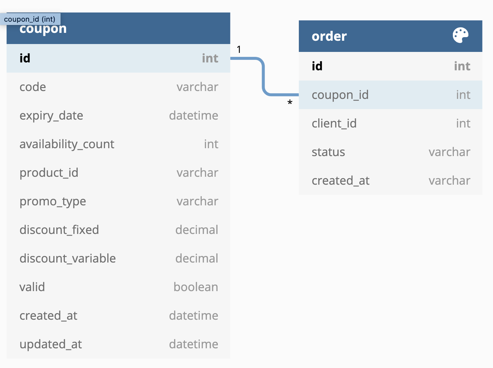
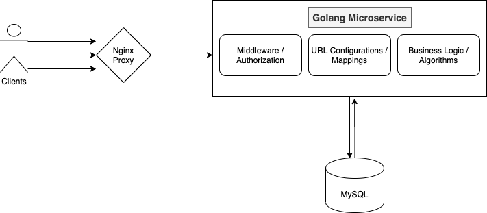

# Coupon-Management-System

An open source system which manages coupon codes, they can be utilised for:

- Discounting
- Promotions
- Referrals
- Growth hacks
- Marketing campaigns, etc.

### Use Cases

- Run a marketing trail by offering cashbacks via unique coupon codes with your products.
- A limited period offer during the festival seasons.
- Discounting via corporate partnerships.
- Bundling the products.
- Cashback rewards.

### Features / Requirements

1. Randomly generate a code of customizable length, count and validity.
2. Validate a coupon code and rate limit the API's to prevent misuse.
3. Token authentication and client identification for the service to be multitenant.
4. Persist the successfull request logs (when the coupon is consumed) for accounting and reference.
5. Optionally maintain its unique mapping with a product.
6. Ability to specify the discounting values (optional).
7. Ability to export or download the logs as an excel file (optional).

___
## Design

### Persistence Layer

The Schema / Model design :

<!-- <iframe width="560" height="315" src='https://dbdiagram.io/embed/5fd2e1e79a6c525a03baa5fa'> </iframe> -->

### Application Layer



## Infrastructure Layer


### Interface Layer
1. Generate a Coupon Code
   ```sh
   curl --location -g --request POST '{{ BASE_URL }}/coupon/' \
    --header 'Authorization: <Token>' \
    --form 'code_length="6"' \
    --form 'expiry_date="15-Jan-2030"' \
    --form 'availability_count="1024"' \
    --form 'product_id="apple123"' \
    --form 'promo_type="voucher"' \
    --form 'discount_fixed="20"'
    ```
2. Get all the details of the Coupon
    ```sh
    curl --location -g --request GET '{{ BASE_URL }}/coupon/?code=AYSB23X2' \
    --header 'Authorization: <Token>'
    ```
3. Update / Delete Coupon attributes
    ```sh
    curl --location -g --request PUT '{{ BASE_URL }}/coupon/AYSB23X2/' \
    --header 'Authorization: <Token>' \
    --form 'availability_count="0"'
    ```
4. Validate a Code
    ```sh
    curl --location -g --request GET '{{ BASE_URL }}/coupon/consume/?code=AYSB23X2&product_id=apple123' \
    --header 'Authorization: <Token>'
    ```
5. Consume a Code
    ```sh
    curl --location -g --request POST '{{ BASE_URL }}/coupon/consume/?code=AYSB23X2' \
    --header 'Authorization: <Token>'
    ```


___
### CI/CD
TODO
### Testing
TODO
### Profiling
TODO
### Demo
TODO
___
## Engineering Commands

Module Management Commands:

```sh
// Start a go based application with modules independent of $GOPATH
go mod init github.com/prajwalnayak7/Coupon-Management-System
```
```
// Build the project and automatically add dependencies
go build -o build
// Clean unwanted dependencies
go mod tidy
// Download all vendor dependencies into a project folder
go mod vendor
```

```
// Format the code
go fmt
```

Set the environment variables
```
cp .env.sample .env
// Edit/Add the environment variables as per the configs in the host machine
```

Setup database
```
sudo docker run --name mysql-8 -p 127.0.0.1:5000:3306 -e MYSQL_ROOT_PASSWORD=pass@123 -d mysql:8.0.19
mysql -u root -p
# Run the scripts /scripts/create_database.sql and /scripts/create_tables.sql
```

Run the app in Docker
```
docker image build -t cms_app .
docker container run -p 8888:5555 cms_app

Try this command: 
curl --location --request GET 'http://127.0.0.1:8888/ping'
```


Start all the Services in single command
```
docker compose up
```
Deploy all the Services in a Kubernetes cluster
```
kompose convert -o kube-config.yaml
kubectl apply -f kube-config.yaml
```
### Note:
> * Feel free to contribute / raise PRs / fork / experiement.
> * The idea was to start small and simple, explore tools and techniques on the way and evolve consistently.
> ** Suggestions / Feedback are always welcome :) 
